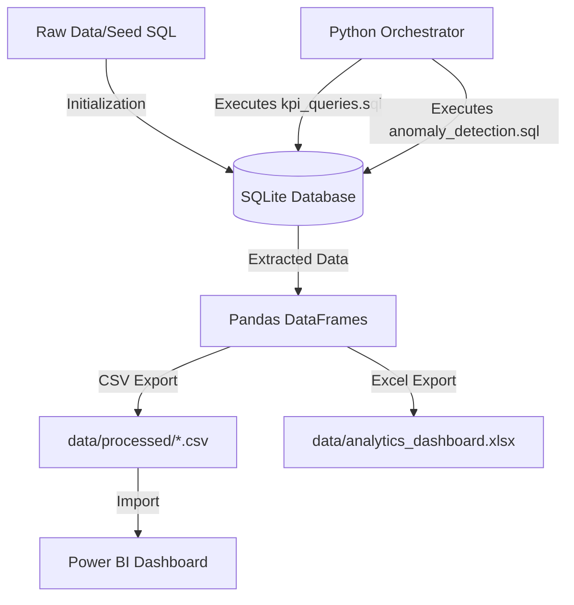

# Operational Analytics Dashboard
A comprehensive SQL-focused analytics system for monitoring business KPIs and detecting transaction anomalies, utilizing Python for automation and Power BI for visualization.


## Project Overview
This project implements an end-to-end data analytics pipeline designed to extract insights from raw transaction and user data. It utilizes advanced SQL capabilities, including window functions and Common Table Expressions (CTEs), to calculate 8 core business KPIs and detect 7 distinct anomaly patterns. The workflow is orchestrated via Python, which automates database initialization, query execution, and exports findings to styled Excel reports and CSV files for Power BI ingestion. This system provides actionable intelligence on user retention, support SLA compliance, and financial integrity without requiring a dedicated data warehouse.

## Architecture Diagram


## Key Features
- **Automated SQL Execution** — Python-based orchestrator (`run_queries.py`) that initializes the SQLite database, seeds data, and executes 15 distinct analytical queries sequentially.
- **Advanced SQL Analytics** — Extensive use of Window Functions (`ROW_NUMBER`, `LAG`, `LEAD`, `NTILE`) and Multi-level CTEs for cohort analysis, user churn calculation, and ranking.
- **Anomaly Detection Pipeline** — Statistical models implemented in SQL utilizing Z-scores and moving averages to identify transaction amount spikes, dormant user reactivation, and consecutive payment failures.
- **Automated Reporting** — Pandas-driven export utilities (`export_to_excel.py`) that transform raw SQL outputs into clean CSVs and professionally styled, multi-sheet Excel dashboards using `openpyxl`.
- **Modular Python Utilities** — Custom classes (`DataCleaner`, `KPICalculator`, `AnomalyDetector`) providing reusable methods for outlier removal, missing value handling, and sudden percentage change detection.

## Tech Stack
| Layer | Technology | Usage |
|-------|------------|-------|
| Database | SQLite | Local relational database for storing 4 normalized tables and executing complex analytical queries |
| Data Processing | Python 3.8+, Pandas | Query orchestration, data cleaning, statistical anomaly detection, and automated report generation |
| Analytics | SQL | Advanced analytical queries for calculating KPIs and detecting anomalies |
| Visualization | Power BI, Excel | Interactive dashboarding (via `powerbi_instructions.md`) and automated Excel report formatting |

## Project Structure
```text
operational-analytics-dashboard/
├── dashboard/
│   └── powerbi_instructions.md    # Power BI data modeling and DAX guide
├── data/
│   ├── processed/                 # Generated CSV exports for Power BI
│   ├── analytics.db               # SQLite database generated by run_queries.py
│   └── analytics_dashboard.xlsx   # Auto-generated styled Excel report
├── python/
│   ├── export_to_excel.py         # Script to format and export DataFrames to Excel
│   ├── run_queries.py             # Main execution engine for DB setup and querying
│   ├── utils.py                   # Reusable Pandas utilities for cleaning/anomaly detection
│   └── requirements.txt           # Python dependencies (pandas, openpyxl, etc.)
└── sql/
    ├── anomaly_detection.sql      # 7 SQL queries for detecting data anomalies
    ├── create_tables.sql          # DDL for 4 normalized tables with 16 indexes
    ├── kpi_queries.sql            # 8 SQL queries calculating core business metrics
    └── seed_data.sql              # DML to populate tables with sample records
```

## API Reference
*N/A — This project operates as an automated data pipeline via CLI scripts rather than a web API.*

## Database Schema

| Table Name | Key Columns | Relationships & Notes |
|------------|-------------|-----------------------|
| `users` | `user_id` (PK), `email`, `subscription_tier`, `signup_date` | Base dimension table, indexed on `signup_date` and `subscription_tier`. |
| `transactions` | `transaction_id` (PK), `user_id` (FK), `amount`, `payment_method`, `transaction_status` | Foreign key to `users(user_id)`. Indexed on date, status, and amount. |
| `support_tickets` | `ticket_id` (PK), `user_id` (FK), `ticket_category`, `status`, `resolution_time_hours` | Foreign key to `users(user_id)`. Tracks SLA compliance. |
| `refunds` | `refund_id` (PK), `transaction_id` (FK), `user_id` (FK), `refund_amount`, `refund_status` | Foreign keys to `transactions(transaction_id)` and `users(user_id)`. |

## ML Pipeline
*N/A — Anomalies are currently detected using purely statistical SQL queries (e.g., Z-scores, moving averages) rather than trained ML models.*

## Environment Variables
*No environment variables are required for the default SQLite setup. The database path is hardcoded to `data/analytics.db` in `run_queries.py`.*

## Getting Started

### Prerequisites
- Python 3.8+
- Git

### Installation
1. Clone the repository and navigate to the project directory:
   ```bash
   git clone <repository_url>
   cd operational-analytics-dashboard
   ```
2. Install Python dependencies:
   ```bash
   pip install -r python/requirements.txt
   ```

### Running Locally
1. Initialize the database and run all SQL KPI/Anomaly queries:
   ```bash
   python python/run_queries.py
   ```
   *(This will create `data/analytics.db`, seed the data, and generate CSVs in `data/processed/`)*
2. Generate the formatted Excel dashboard:
   ```bash
   python python/export_to_excel.py
   ```
   *(Output will be saved to `data/analytics_dashboard.xlsx`)*

## Docker Setup
*N/A — Designed to run natively with local Python and SQLite.*

## Screenshots / Demo
*(Placeholder for Power BI dashboard or Excel report screenshots)*

## Known Limitations
- The pipeline currently uses a local SQLite database, which is not suitable for concurrent write operations or distributed production workloads.
- Sample data is synthetically generated via `seed_data.sql`; production accuracy of anomaly detection thresholds (e.g., Z-score > 3) may require tuning based on real historical data.
- The Python orchestrator reads SQL queries by splitting on semicolons, which may fail if semicolons exist within SQL strings or comments.
- No rate limiting, authentication, or automated scheduling (e.g., cron/Airflow) is implemented for pipeline execution.

## Future Improvements
- Migrate database connection to PostgreSQL and configure SQLAlchemy for robust connection pooling.
- Implement Apache Airflow or Prefect to schedule and monitor the data pipeline execution.
- Refactor the query parser in `run_queries.py` to use a dedicated SQL parsing library for safer execution.
- Integrate a machine learning model (e.g., Isolation Forest in `utils.py`) to supplement statistical anomaly detection.

## Author
GitHub Copilot (Refactored and Analyzed)
